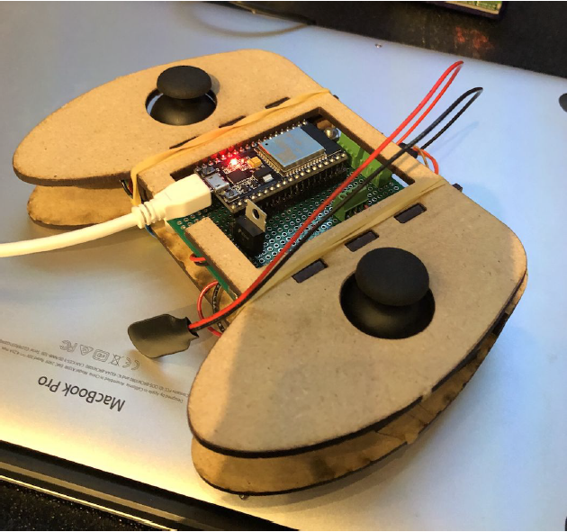
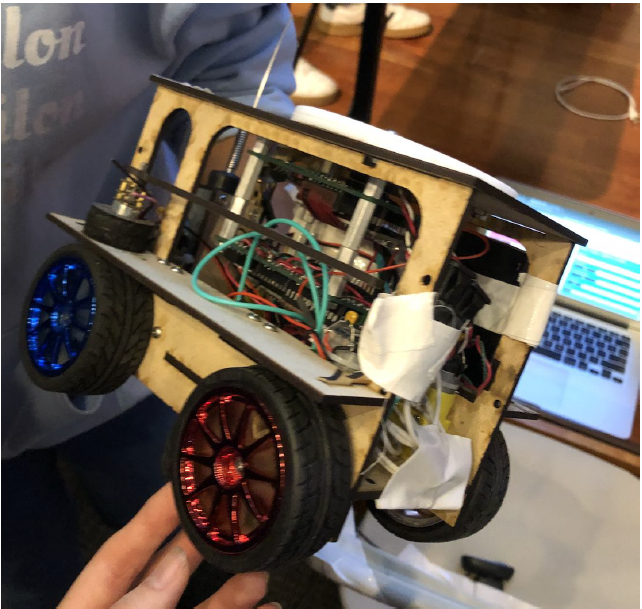
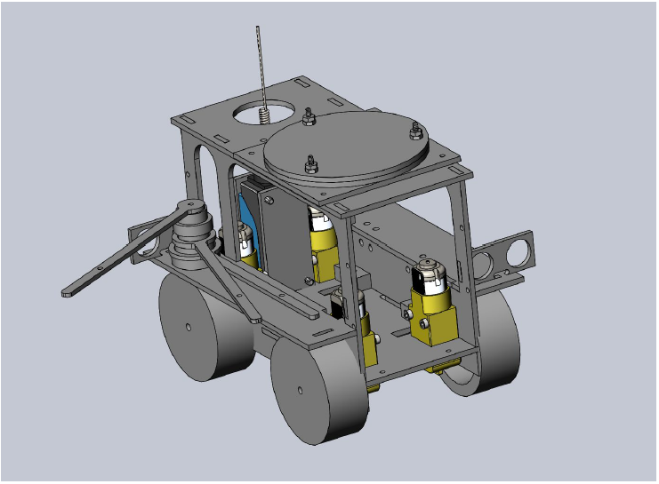
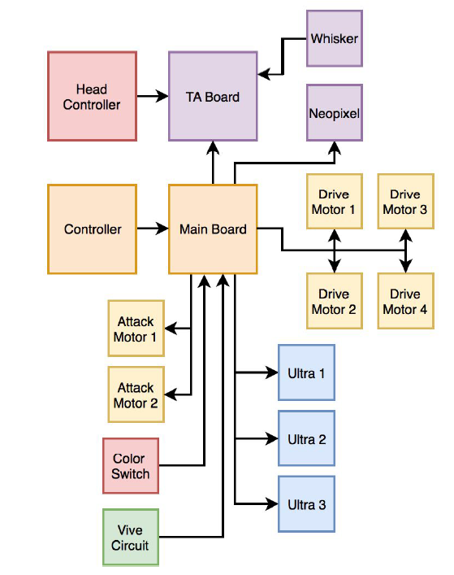

# Battle-Bots

### Description:

Designed and fabricated a 4 wheel drive robot controlled by ESP32 and Teensy 2.0 microcontrollers.

    
  
  
  CAD Model
  
  
  
    
   CPU Architecture
   
   
    
    
