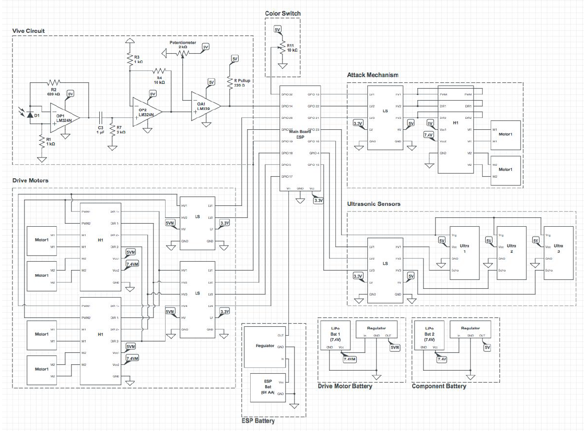

# Battle-Bots
with Dr Mark Yim, UPenn

# Description:

Designed and Fabricated a 4 wheel drive sem-autonomous robot controlled by ESP32 and Teensy 2.0 microcontrollers localized with HTC Vive. I2C communication was used between two ESP 32s and WiFi was used to relay information to a central server. 

    
  
  
    
   
      
   
    
    
